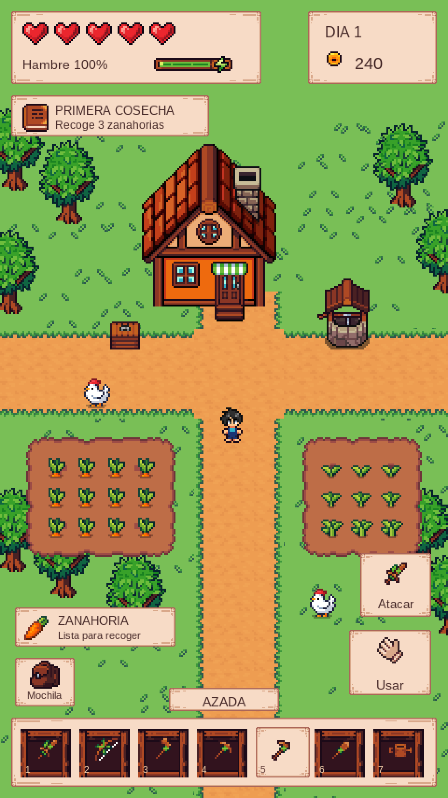

# Muestra de juego con los sprites existentes

Muestra compuesta de 960 × 1708 píxeles, en formato vertical, con recursos del proyecto. No se ha usado generación de imágenes ni ilustraciones de las propuestas anteriores.

Se han recortado y compuesto 15 hojas PNG existentes: terreno, caminos, casa, árboles, pozo, cofre, cultivos, gallinas, Josh, paneles, casillas, corazones, barras, monedas e iconos de herramientas. Los paneles se adaptan mediante nine-slice y los sprites se amplían con vecino más próximo. La fuente también procede del proyecto.

El HUD incluye salud, hambre, día, monedas, misión, aviso de cosecha, mochila, botones de acción y siete herramientas. Los textos y la colocación son una propuesta de UI. Las cifras son ejemplos.

**Es una maqueta de cómo podría verse el juego, no una captura de una build funcional.** Se comprobó la escena Main en Unity Play: actualmente varios elementos presentan hojas de sprites completas en vez de recortes individuales. La muestra no modifica la escena ni soluciona esas referencias.

- `build_preview.py`: composición reproducible a partir de los originales.
- `sprites-utilizados.json`: rutas originales y coordenadas de recorte.
- `gameplay-base-480x854.png`: composición antes de la ampliación final.

La revisión actual del usuario pide usar los sprites del proyecto, sin sustituirlos por arte nuevo o generado.
