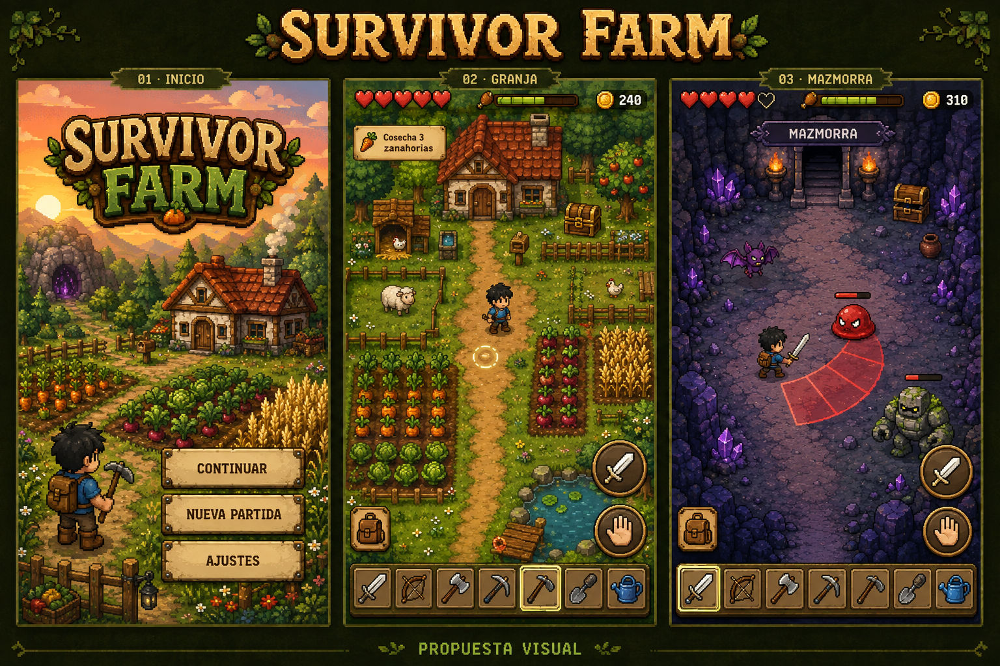
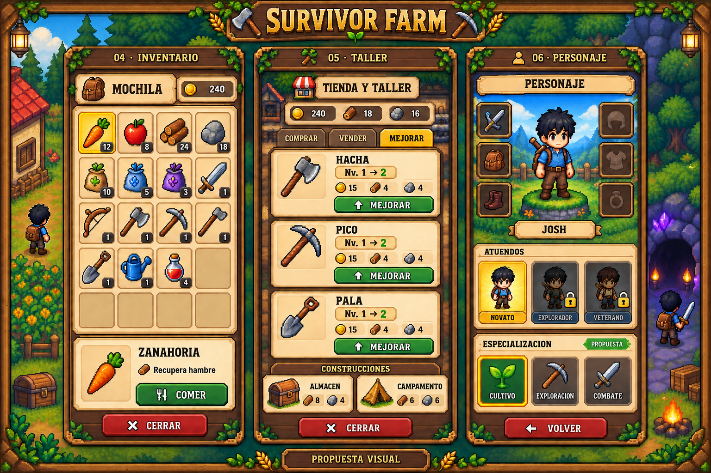
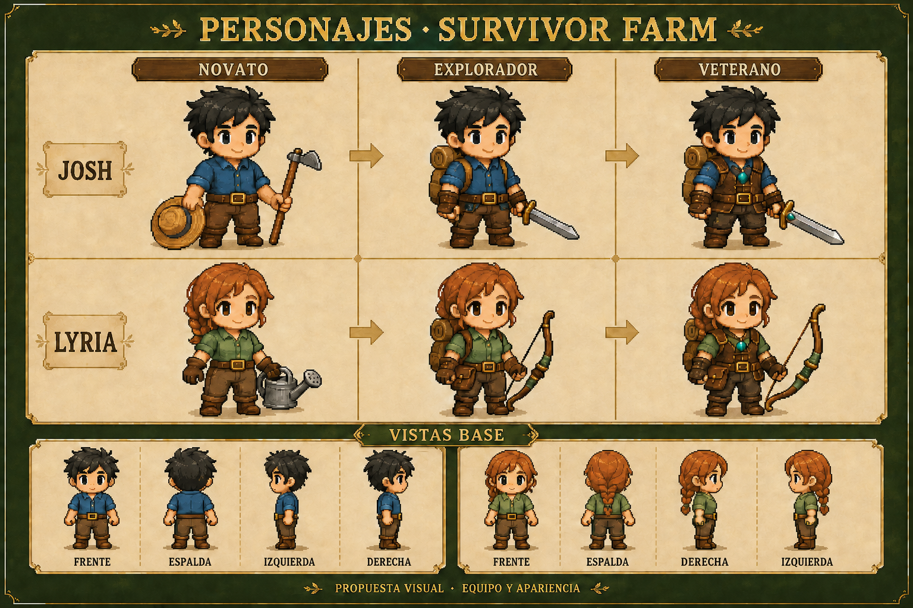
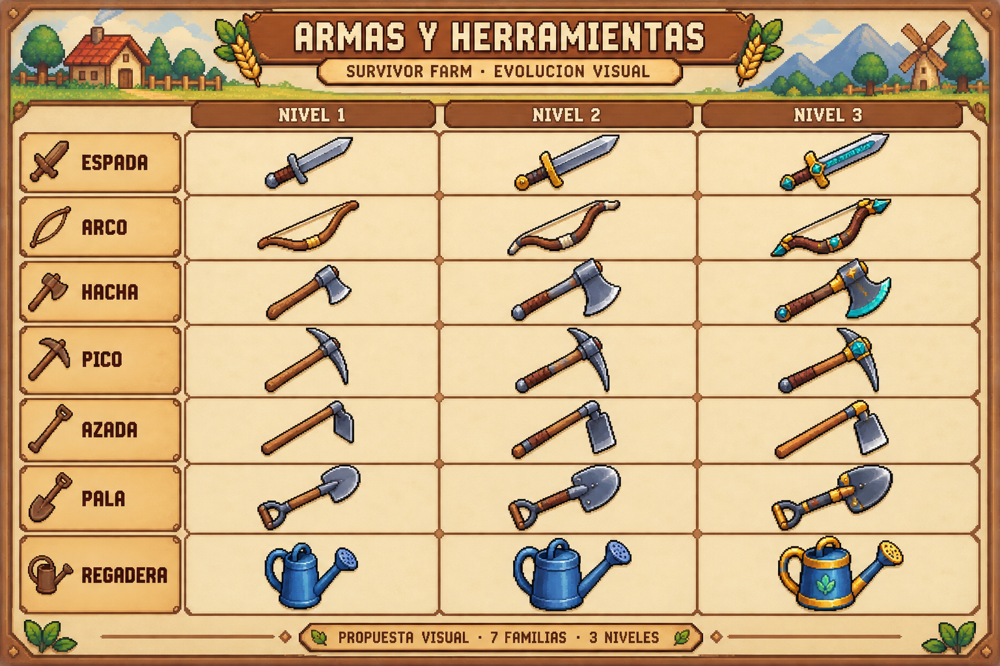
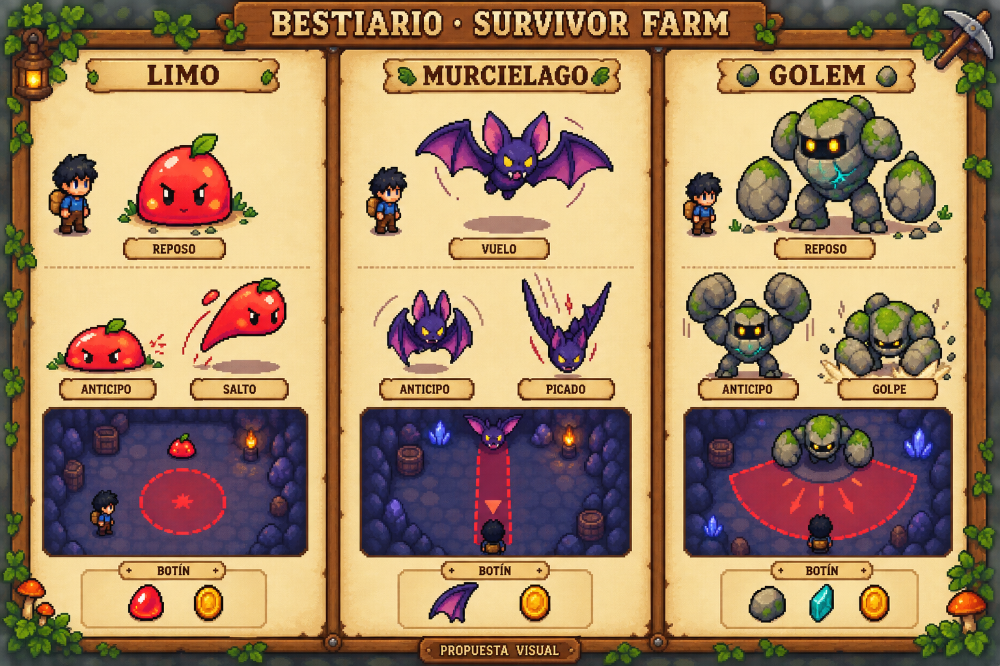

# Galería visual — Survivor Farm

Cinco láminas de concepto. Consulta [README.md](README.md) para las fuentes y [DESARROLLO.md](DESARROLLO.md) para distinguir mecánicas actuales y propuestas.

## Inicio, granja y mazmorra

## Inventario, taller y personaje

## Desarrollo de personajes

## Armas y herramientas

## Enemigos

